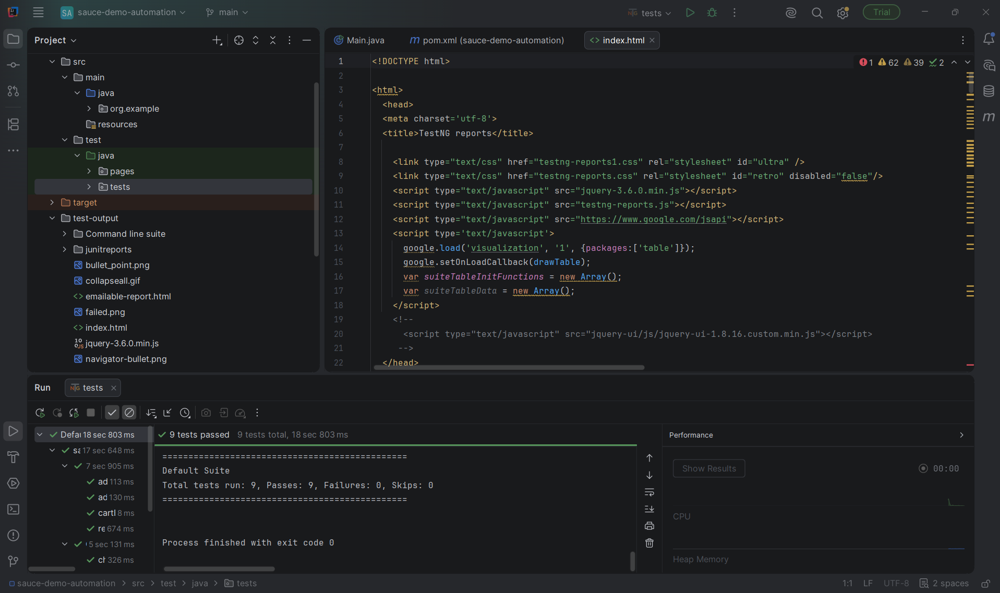

# SauceDemo Test Automation Suite


Automated regression testing suite for [SauceDemo](https://www.saucedemo.com), built using Selenium WebDriver and TestNG, following the Page Object Model (POM) design pattern.

## Tech Stack
- Java 17
- Selenium WebDriver 4.21
- TestNG 7.10
- Maven
- WebDriverManager (automatic browser driver management)
- GitHub Actions (CI — runs the suite headless on every push/PR to `main`)

## Test Coverage
- **Login:** valid login, invalid credentials, locked-out user
- **Cart:** add single/multiple items, badge count verification, remove items
- **Checkout:** end-to-end purchase flow, form validation (missing required fields)

## Design Pattern
Uses Page Object Model — each page (`LoginPage`, `CartPage`, `CheckoutPage`) encapsulates its own locators and actions, keeping test logic separate from page interaction. Explicit waits (`WebDriverWait`) handle synchronization on dynamic page transitions.

A shared `BaseTest` owns WebDriver setup/teardown (including switching to headless Chrome automatically when running in CI); each test class extends it and only adds what's specific to that flow (login, page-object initialization).

## How to Run
```bash
mvn test
```
Runs headed locally by default. Clone the repo, make sure Java 17 and Maven are installed, and run the command above — Maven and WebDriverManager handle the rest (dependencies, matching chromedriver).

## CI
Every push/PR to `main` triggers [`.github/workflows/tests.yml`](.github/workflows/tests.yml), which runs the full suite headless on Ubuntu and uploads the TestNG/Surefire report as a build artifact.

## Results
9/9 tests passing.


